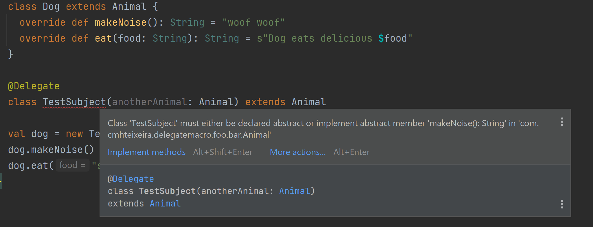

# Delegate Macro &emsp; [](https://www.travis-ci.com/cmhteixeira/delegate-macro)

## Motivation
This macro enables you to delegate/proxy the implementation of an interface to an injected dependency in a very straightforward way. It saves you from the tedious work of doing it manually.

Apply this macro to a class that implements an interface. At compile-time, the macro will
implement the interface methods on your class using a dependency that you inject on that class, with the exception
of the methods you implement manually on the source code.
The value is in saving you from the tedious task of doing that yourself. It is the more usefull the more methods
in the interface there are.

### Example

```scala
trait Connection {
  def method1(a: String): String
  def method2(a: String): String
  // 96 other abstract methods
  def method100(a: String): String
}

@Delegate
class MyConnection(delegatee: Connection) extends Connection {
  def method10(a: String): String = "Only method I want to implement manually"
}

// The source code above would be equivalent, after the macro expansion, to the code below
class MyConnection(delegatee: Connection) extends Connection {
  def method1(a: String): String = delegatee.method1(a)
  def method2(a: String): String = delegatee.method2(a)
  def method10(a: String): String = "Only method I need to implement manually"
  // 96 other methods that are proxied to the dependency delegatee
  def method100(a: String): String = = delegatee.method100(a)
}
```

## Support

| Library | Scala 2.11 | Scala 2.12 | Scala 2.13 |
|---------|------------|------------|------------|
| 0.1.1   | Yes        | Yes        | Yes        |

| Scala 2.11                                                  | Scala 2.12                                                 | Scala 2.13                                                           |
|-------------------------------------------------------------|------------------------------------------------------------|----------------------------------------------------------------------|
| Import macro paradise plugin  | Import macro paradise plugin | Enable compiler flag `-Ymacro-annotations` required |

### Using macro paradise plugin

Link to macro repo: https://github.com/scalamacros/paradise  

#### gradle
Add the following 3 portions to your build

```gradle
// build.gradle
.....
configurations {
   scalaCompilerPlugin
}

dependencies {
  scalaCompilerPlugin "org.scalamacros:paradise_<your-scala-version>:<plugin-version>"
}

tasks.withType(ScalaCompile) {
  scalaCompileOptions.additionalParameters = [
    "-Xplugin:" + configurations.scalaCompilerPlugin.asPath
  ]
}
.... 
```
where `<your-scala-version>` must be the full scala version. For example `2.12.13`, and not `2.12`.

If that doesn't work, google for alternatives.
#### sbt
It should be quite straightforward.  
Add the following line to your build. 
```
addCompilerPlugin("org.scalamacros" % "paradise_<your-scala-version>" % "<plugin-version>")
``` 
Where `<your-scala-version>` must be the full scala version. For example `2.12.13`, and not `2.12`. 

If that doesn't work, google for alternatives.

### Enabling `-Ymacro-annotations`

In version `2.13`, the functionality of macro paradise has been included in the scala compiler directly. However, you must still enable the compiler flag `-Ymacro-annotations`.


## IntelliJ IDEA

There is no IntelliJ support.  
This means, regardless of your Scala version, your IDE won't be able to expand the macro. Therefore, it will underline your annotated class with those red squiggly lines, stating your class does not implement all methods of the interface.  
Don't worry about that. It is aesthetically unpleaseant, but of no real consequence.   
The solution would be to develop a public plugin for Intellij for this macro.


